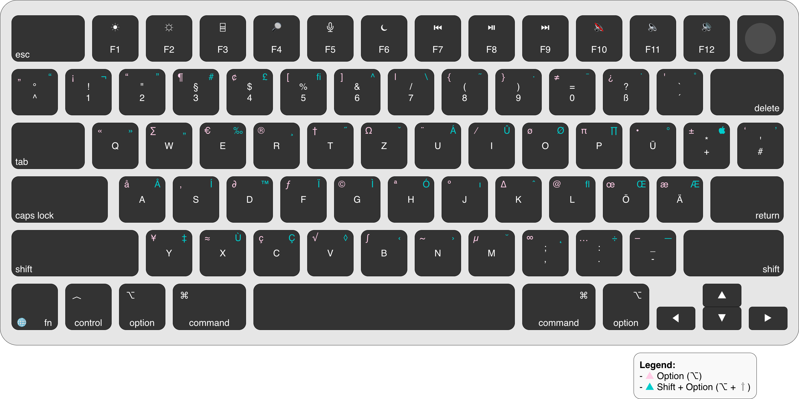

# ⌨️ DE Keyboard Keymap 

## 🎯 Purpose

This document provides a practical reference for the **German (QWERTZ) keyboard layout on macOS**, focusing on:

* Character production using modifiers (⌥, ⇧, ⇧ + ⌥)
* Frequently used symbols
* Umlauts and language-specific characters
* Differences vs US layout
* Real usage patterns

---

## 🗺️ Full Keyboard Layout

---

## 🧠 How to Read the Layout

Each key can produce multiple characters depending on modifiers:

* **Default** → lowercase letter or base symbol
* **Shift (⇧)** → uppercase or alternate symbol
* **Option (⌥)** → special characters
* **Shift + Option (⇧ + ⌥)** → extended characters

👉 The layout is optimized for **German writing**, with relatively good access to symbols.

---

## 🔤 Language-Specific Characters

German layout includes direct access to:

| Character | Notes             |
| --------- | ----------------- |
| ä         | vowel with umlaut |
| ö         | vowel with umlaut |
| ü         | vowel with umlaut |
| ß         | Eszett (sharp s)  |

👉 These are **first-class keys**, not combinations.

---

## 💻 Essential Symbols (QWERTZ Reality)

Compared to US:

| Character | Shortcut      |       
| --------- | ------------- | 
| { }       | ⌥ + 8 / ⌥ + 9 |       
| [ ]       | ⌥ + 5 / ⌥ + 6 |       
| < >       | < / ⇧ + <     |       
| /         | ⇧ + 7         |       
| \         | ⌥ + ⇧ + 7     |       
| \|        | ⌥ + 7         |
| ~         | ⌥ + n         |       
| `         | ⌥ + ^         |       
| ^         | ^ (dead key)  |       
| @         | ⌥ + L         |       

---

## ⌥ Frequently Used Option Characters

| Character | Shortcut  |
| --------- | --------- |
| €         | ⌥ + E     |
| @         | ⌥ + L     |
| {         | ⌥ + 8     |
| [         | ⌥ + 5     |
| \         | ⌥ + ⇧ + 7 |
| ~         | ⌥ + N     |

---

## ⇧ + ⌥ Extended Characters

| Character | Shortcut  |
| --------- | --------- |
| ±         | ⇧ + ⌥ + = |
| ≠         | ⇧ + ⌥ + - |
| ≤         | ⇧ + ⌥ + , |
| ≥         | ⇧ + ⌥ + . |
| •         | ⇧ + ⌥ + 8 |

---

## 🔤 Dead Keys (Accents)

German layout also supports dead keys:

| Character | Shortcut |
| --------- | -------- |
| â         | ^ → a    |
| ê         | ^ → e    |
| ô         | ^ → o    |
| ñ         | ~ → n    |

👉 Press accent first, then letter.

---

## 📚 Key Differences vs US

| Feature | Difference              |
| ------- | ----------------------- |
| Y / Z   | swapped (QWERTZ)        |
| Umlauts | direct keys             |
| Symbols | partially redistributed |
| @       | requires Option         |

---

## 💡 Practical Usage

* Good balance between writing and symbols
* Better than FR for coding, worse than US
* Umlauts are extremely efficient

---

## ⚠️ Common Pitfalls

* Confusing Y and Z
* Forgetting Option for symbols like @
* Expecting US symbol positions

---

## ⚡ Note on Shortcuts

The keyboard layout defines **how characters are produced**.

System actions depend on **key position**, not visible letters.

---

## 🔤 Character Reference

If you cannot produce a specific character:

→ See [Character Reference](characters.md)

For additional symbols:

→ See [Global Character Reference](../characters.md)

This provides a complete set of copyable symbols which are not tied to a specific layout.

---

## 🔄 Cross-Layout Reference

If you use the DE layout as your visual or physical reference and want to type in another layout:

→ See [Cross-Layout Mappings](../_mappings/README.md)

This provides a 1:1 mapping between keys across different keyboard layouts.

---

## 🔗 Related

* Explore [Mappings](../_mappings/) for 1:1 base-key mappings between different layouts
* See [Shortcuts](shortcuts.md) for layout-specific shortcuts
* See [Tips](tips.md)  for practical usage
