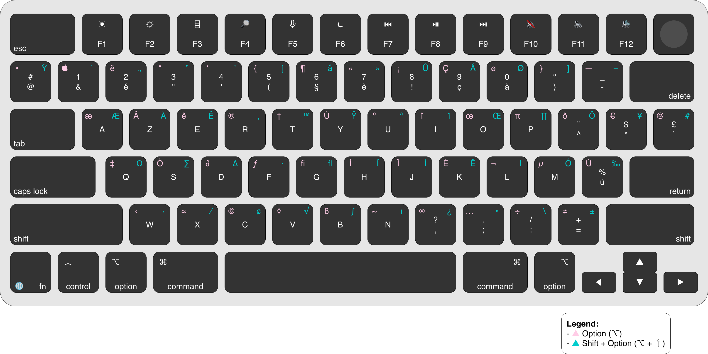

# ⌨️ FR Keyboard Keymap 

## 🎯 Purpose

This document provides a practical reference for the **French (AZERTY) keyboard layout on macOS**, focusing on:

* Character production using modifiers (⌥, ⇧, ⇧ + ⌥)
* Frequently used symbols
* Differences vs US layout
* Real usage patterns

---

## 🗺️ Full Keyboard Layout

---

## 🧠 How to Read the Layout

Each key can produce multiple characters depending on modifiers:

* **Default** → lowercase letter or base symbol
* **Shift (⇧)** → uppercase or alternate symbol
* **Option (⌥)** → special characters
* **Shift + Option (⇧ + ⌥)** → extended characters

👉 The FR layout is optimized for **French writing**, not symbol-heavy workflows.

---

## 💻 Essential Symbols (AZERTY Reality)

Unlike US layout, many symbols require modifiers:

| Character | Shortcut      |           
| --------- | ------------- | 
| { }       | ⌥ + 5 / ⌥ + ° |           
| [ ]       | ⌥ + ( / ⌥ + ) |           
| < >       | < / ⇧ + <     |           
| /         | ⇧ + :         |           
| \         | ⌥ + ⇧ + :     |           
|\|         | ⌥ + ⇧ + L     |           
| ~         | ⌥ + N         |           
| `         | ⌥ + 7         |           
| ^         | ^ (dead key)  |           
| #         | ⌥ + 3         |           

---

## ⌥ Frequently Used Option Characters

Based on the layout:

| Character | Shortcut |          
| --------- | -------- |
| €         | ⌥ + 4    |           
| @         | ⌥ + 2    |           
| #         | ⌥ + 3    |           
| {         | ⌥ + 5    | 
| [         | ⌥ + (    |

---

## ⇧ + ⌥ Extended Characters

| Character | Shortcut              |
| --------- | --------------------- |
| « »       | ⌥ + ⇧ + W / ⌥ + ⇧ + X |
| •         | ⌥ + ⇧ + 8             |
| …         | ⌥ + ;                 |
| ±         | ⌥ + ⇧ + =             |
| ≠         | ⌥ + ⇧ + :             |

---

## 🔤 Accents & Dead Keys

The FR layout relies heavily on **dead keys**:

| Character | Shortcut |
| --------- | -------- |
| é         | 2        |
| è         | 7        |
| à         | 0        |
| ù         | %        |
| ê         | ^ → e    |
| ë         | ¨ → e    |

👉 Press the accent first, then the letter.

---

## 📚 Punctuation Differences vs US

| Character | FR Access |
| --------- | --------- |
| .         | ⇧ + ;     |
| ,         | ;         |
| :         | ⇧ + .     |
| !         | ⇧ + §     |
| ?         | ⇧ + ,     |

---

## 💡 Practical Usage

* Symbols are **not directly accessible like US**
* Heavy use of **Option (⌥)** is required
* Dead keys are essential for writing

---

## ⚠️ Common Pitfalls

* Expecting US symbol positions → incorrect
* Forgetting dead keys → incorrect accents
* Symbol access slower for coding tasks

---

## ⚡ Note on Shortcuts

The keyboard layout defines **how characters are produced**.

System actions (Copy, Paste, etc.) depend on **key position**, not characters.

---

## 🔤 Character Reference

If you cannot produce a specific character:

→ See [Character Reference](characters.md)

This provides a complete set of copyable characters.

---

## 🔄 Cross-Layout Reference

If you use the FR layout as your visual or physical reference and want to type in another layout:

→ See [Cross-Layout Mappings](../_mappings/README.md)

This provides a 1:1 mapping between keys across different keyboard layouts.

---

## 🔗 Related

* Explore [Mappings](../mappings/) for 1:1 base-key mappings between different layouts
* See [Shortcuts](shortcuts.md) for layout-specific usage
* See [Tips](tips.md) or practical guidance
