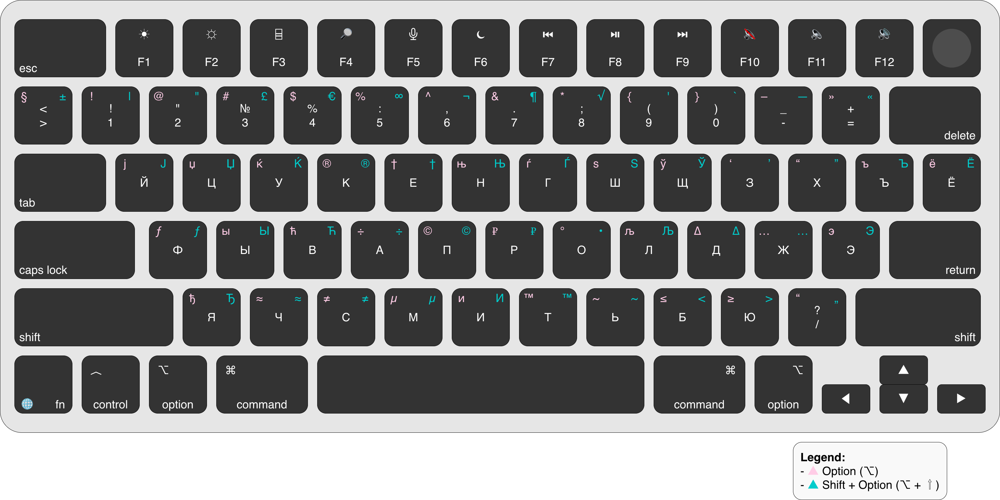

# ⌨️ RU Keyboard Keymap 

🎯 Purpose

This document provides a practical reference for the **Russian keyboard layout on macOS**, focusing on:

* How characters are produced
* Cyrillic alphabet usage
* Option (⌥) and Shift behavior
* Practical usage for writing and system interaction
* Frequently used non-obvious characters
* Differences vs symbol-oriented layouts
* Real usage patterns

---

## 🗺️ Full Keyboard Layout

---

## 🧠 How to Read the Layout

Each key produces different characters depending on modifiers:

* **Default** → lowercase Cyrillic letter
* **Shift (⇧)** → uppercase Cyrillic letter
* **Option (⌥)** → additional symbols
* **Shift + Option (⇧ + ⌥)** → extended characters

👉 Refer to the layout diagram for exact mappings.

---

## 💻 Essential Symbols (Actual RU Layout)

These are commonly needed symbols and how to access them:

| Character | Shortcut  |
| --------- | --------- |
| < >       | ⌥ + Б / Ю |
| { }       | ⌥ + Х / Ъ |
| [ ]       | ⌥ + Ф / Ы |
| /         | ⇧ + .     |
| \         | ⌥ + -     |
| |         | ⇧ + ⌥ + - |
| ~         | ⌥ + Ч     |
| `         | ⌥ + Ё     |
| ^         | ⌥ + 6     |
| #         | ⌥ + 3     |

---

## ⌥ Frequently Used Option Characters

Based on the layout you provided:

| Character | Shortcut |
| --------- | -------- |
| €         | ⌥ + 4    |
| ₽         | ⌥ + 3    |
| ™         | ⌥ + Т    |
| ®         | ⌥ + К    |
| ©         | ⌥ + С    |
| •         | ⌥ + 8    |

---

## ⇧ + ⌥ Extended Characters

Less obvious but useful:

| Character | Shortcut      |
| --------- | ------------- |
| ±         | ⇧ + ⌥ + =     |
| ≤         | ⇧ + ⌥ + ,     |
| ≥         | ⇧ + ⌥ + .     |
| ≠         | ⇧ + ⌥ + -     |
| « »       | ⇧ + ⌥ + , / . |

---

## 🔤 Punctuation Differences

Important differences from US:

| Character | RU Access |
| --------- | --------- |
| ?         | ⇧ + 7     |
| :         | ⇧ + 6     |
| "         | ⇧ + 2     |
| @         | ⌥ + 2     |

---

## 💡 Practical Usage

* Symbols are **less clustered than US**
* Option key is required more frequently
* Some programming symbols require adaptation

---

## ⚠️ Common Pitfalls

* Expecting US symbol positions → incorrect
* Forgetting ⌥ combinations → slows down typing
* Mixing layouts mid-task → confusion

---

## ⚡ Note on Shortcuts

The layout defines how characters are produced.

System shortcuts remain consistent, but depend on **physical key positions**, not letters.

---

## 🔗 Related

* Explore [Mappings](../_mappings/) for 1:1 base-key mappings between different layouts
* See [Shortcuts](shortcuts.md) for layout-specific usage
* See [Tips](tips.md) for practical guidance
