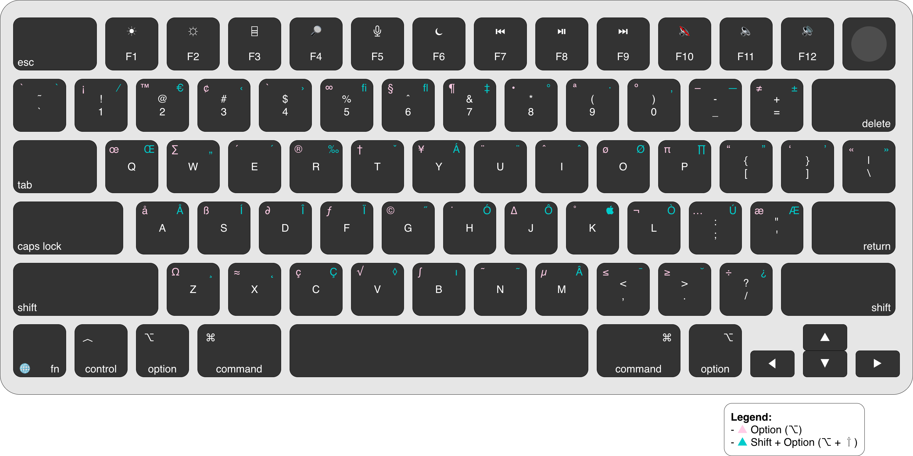

# ⌨️ US Keyboard Keymap 

## 🎯 Purpose

This document provides a complete reference for the **US keyboard layout on macOS**, focusing on:

* How characters are produced
* Special symbols and programming characters
* Option (⌥) and Shift behavior
* Practical usage for development

---

## 🗺️ Full Keyboard Layout

---

## 🧠 How to Read the Layout

Each key can produce multiple characters depending on modifiers:

* **Default** → standard character
* **Shift (⇧)** → uppercase or secondary symbol
* **Option (⌥)** → special characters
* **Shift + Option (⇧ + ⌥)** → extended characters

👉 Most advanced symbols are accessed using **Option (⌥)**.

---

## 💻 Essential Programming Characters

These are the most commonly used characters in development:

| Character | Shortcut  |
| --------- | --------- |
| { }       | ⇧ + [ / ] |
| [ ]       | [ / ]     |
| ( )       | ⇧ + 9 / 0 |
| < >       | ⇧ + , / . |
| =         | =         |
| +         | ⇧ + =     |
| -         | -         |
| _         | ⇧ + -     |
| /         | /         |
| \         | \         |
| |         | ⇧ + \     |

---

## ⌥ Useful Option Characters

Frequently used special characters:

| Character | Shortcut  |
| --------- | --------- |
| €         | ⌥ + ⇧ + 2 |
| ™         | ⌥ + 2     |
| ©         | ⌥ + g     |
| ®         | ⌥ + r     |
| •         | ⌥ + 8     |
| √         | ⌥ + v     |

---

## 🔤 Writing & Accents (Dead Keys)

The Option key enables accented characters using **dead keys**:

| Character | Shortcut  |
| --------- | --------- |
| á         | ⌥ + e → a |
| é         | ⌥ + e → e |
| ñ         | ⌥ + n → n |
| ü         | ⌥ + u → u |

👉 Press the combination first, then the letter.

---

## 📚 Extended Reference (Selected Keys)

Examples of Option and Shift+Option behavior:

| Key | ⌥ Option   | ⇧ + ⌥ |
| --- | ---------- | ----- |
| A   | å          | Å     |
| E   | ´ (accent) | ´     |
| I   | ˆ          | ˆ     |
| N   | ˜          | ˜     |
| O   | ø          | Ø     |
| U   | ¨          | ¨     |

---

## 🧠 Practical Tips

* Use **US layout for development** → best compatibility
* Learn high-frequency symbols first
* Use Option key intentionally
* Combine this with shortcuts and workflows

---

## ⚠️ Common Confusions

* `⌘` (Command) ≠ `⌥` (Option)
* Some symbols differ across keyboard layouts (e.g., @, [])
* Accents require a two-step input

---

## ⚡ Note on Shortcuts

The keyboard layout defines **how characters are produced**.

System actions such as:

* Copy / Paste
* Navigation
* Window management
* Application control

are **not part of the keymap**, but part of macOS behavior.

These are documented separately.

---

## 🔤 Character Reference

If you cannot produce a specific character using the keyboard:

→ See [Character Reference](characters.md)

This provides a complete set of copyable characters.

---

## 🔄 Cross-Layout Reference

If you use the US layout as your visual or physical reference and want to type in another layout:

→ See [Cross-Layout Mappings](../_mappings/README.md)

This provides a 1:1 mapping between keys across different keyboard layouts.

---

## 🔗 Related

* Explore [Mappings](../_mappings/) for 1:1 base-key mappings between different layouts
* See [Shortcuts](shortcuts.md) for layout-specific shortcuts
* See [Tips](tips.md)  for practical usage

